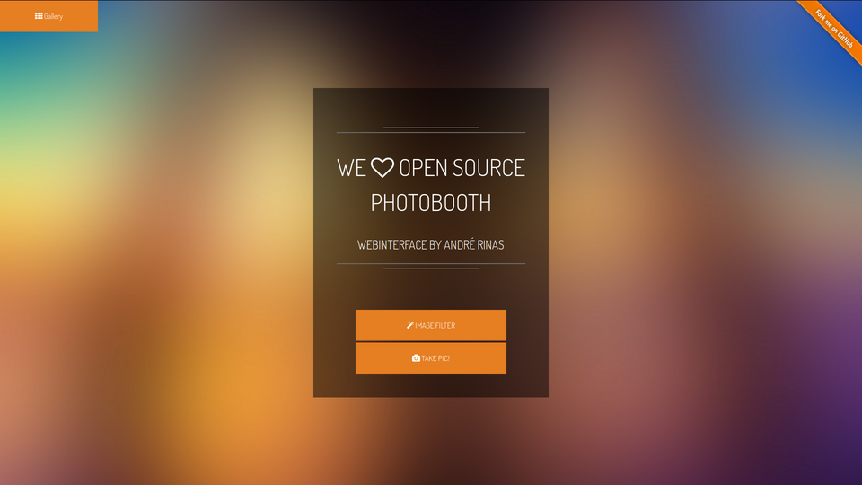

# Photobooth-Wiki

A Photobooth webinterface for Raspberry Pi and Windows.

## Installation

* [Installation on Raspbian](https://github.com/andreknieriem/photobooth/wiki/Installation-on-Debian)
* [Installation on Debian / Debian based distributions](https://github.com/andreknieriem/photobooth/wiki/Installation-on-Debian#installation-on-debian--debian-based-distributions)
* [Installation on Windows](https://github.com/andreknieriem/photobooth/wiki/Installation-on-Windows)

## FAQ - Frequently asked questions
* **Q:** [Is my Camera supported?](FAQ#is-my-camera-supported)
* **Q:** [Is Pi Camera supported?](FAQ#is-pi-camera-supported)
* **Q:** [I've found a bug, how can I report?](FAQ#ive-a-white-page-after-updating-to-latest-source-how-can-i-solve-this)
* **Q:** [I've a white page after updating to latest Source, how can I solve this?](FAQ#ive-a-white-page-after-updating-to-latest-source-how-can-i-solve-this)
* **Q:** [How do I change the configuration?](FAQ#how-do-i-change-the-configuration)
* **Q:** [How to change the language?](FAQ#how-do-i-change-the-configuration)
* **Q:** [How to keep pictures on my Camera using gphoto2?](FAQ#how-to-keep-pictures-on-my-camera-using-gphoto2)
* **Q:** [Can I use Hardware Button to take a Picture on my Raspberry Pi?](FAQ#can-i-use-hardware-button-to-take-a-picture-on-my-raspberry-pi)
* **Q:** [How do I enable Kiosk Mode to automatically start Photobooth in full screen?](FAQ#how-do-i-enable-kiosk-mode-to-automatically-start-photobooth-in-full-screen)
* **Q:** [How to disable the blank screen on Raspberry Pi (Raspbian)?](FAQ#how-to-disable-the-blank-screen-on-raspberry-pi-raspbian)
* **Q:** [Can I use a live stream as background?](FAQ#can-i-use-a-live-stream-as-background)
* **Q:** [I've trouble setting up E-Mail config. How do I solve my problem?](FAQ#ive-trouble-setting-up-e-mail-config-how-do-i-solve-my-problem)
* **Q:** [Chromakeying isn't working if I access the Photobooth page on my Raspberry Pi, but it works if I access Photobooth from an external device (e.g. mobile phone or tablet). How can I solve the problem?](FAQ#chromakeying-isnt-working-if-i-access-the-photobooth-page-on-my-raspberry-pi-but-it-works-if-i-access-photobooth-from-an-external-device-eg-mobile-phone-or-tablet-how-can-i-solve-the-problem)
* **Q:** [How to ajust the php.ini file?](FAQ#how-to-ajust-the-phpini-file)
* **Q:** [How to setup a Raspberry Pi as an acess point?](RPi-as-acess-point)

## Tutorials

* [How to setup a Raspberry Pi as an acess point?](RPi-as-acess-point)

#### Wiki History

View all changes made in this Wiki [here](_history).